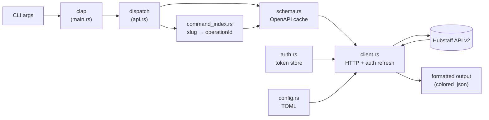
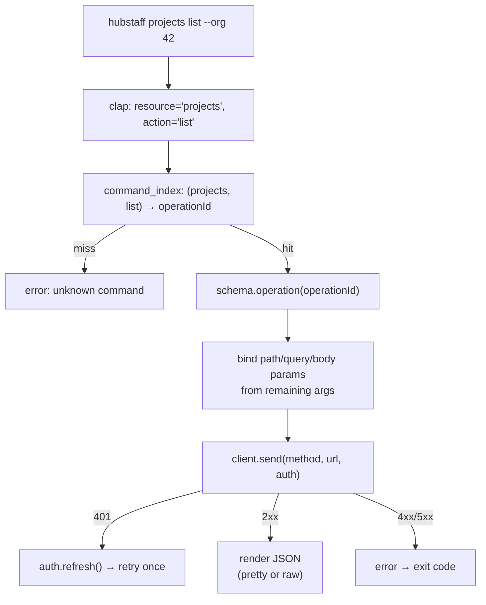
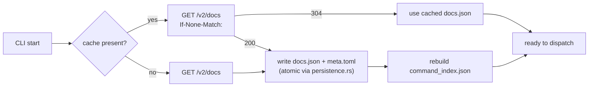

# Contributing to hubstaff-cli

Thanks for your interest in contributing. This guide is the map for landing a change.

## Architecture

`hubstaff` is a schema-driven CLI: every subcommand you can run is derived from the live OpenAPI document at `https://api.hubstaff.com/v2/docs`. There is no per-endpoint handler code. The schema is fetched once, cached on disk, and traversed on each invocation to turn `hubstaff <resource> <action>` into an HTTP call.

### System Overview



### Command Dispatch



### Schema Caching Lifecycle



Cache lives under `$XDG_CONFIG_HOME/hubstaff/schema/v2/` (or the OS equivalent). It is keyed by `api_url`, so pointing at staging gives you a separate cache.

### Module Map

| Module | Responsibility |
| --- | --- |
| `src/main.rs` | clap entrypoint, top-level subcommand routing |
| `src/api.rs` | dynamic dispatch for schema-driven commands |
| `src/command_index.rs` | slug ↔ `operationId` mapping; snapshot-tested command table |
| `src/schema.rs` | OpenAPI fetch, ETag-conditional refresh, disk cache |
| `src/client.rs` | HTTP (reqwest blocking + rustls), auth-aware retries |
| `src/auth.rs` | personal access token storage and refresh |
| `src/config.rs` | TOML config I/O, XDG path resolution, defaults |
| `src/config_commands.rs` | `hubstaff config` subcommand handlers |
| `src/commands_list.rs` | `hubstaff list` — discovery output |
| `src/check.rs` | `hubstaff check` diagnostics (config, credentials, reachability, schema cache) |
| `src/persistence.rs` | atomic file writes (tempfile + rename) |
| `src/error.rs` | error enum → exit code (1 API, 2 auth, 3 config, 4 network) |

## Local Development

Toolchain is pinned by `rust-toolchain.toml` (Rust 1.95.0, edition 2024). Install the tooling once:

```bash
just install-tools    # cargo-deny, cargo-audit, cargo-auditable
```

## Testing

```bash
just test                              # cargo test --all-features
cargo test --test commands_test        # integration suite only
cargo test <name>                      # filter by test name
```

### Unit Tests

`#[cfg(test)]` blocks in `src/*` cover the internals: `auth`, `client`, `config`, `command_index`, `schema`, `check`, `error`. Keep new unit tests next to the code they exercise.

### Integration Tests

`tests/commands_test.rs` runs the compiled binary end-to-end. HTTP is stubbed with **mockito** and each test gets an isolated XDG home so cache state never leaks between cases. Helpers at the top of the file:

- `cli_bin()` — absolute path to the compiled `hubstaff` binary.
- `temp_xdg()` — fresh temp dir to use as `XDG_CONFIG_HOME`.
- `run(&["args", ...], &xdg_dir)` — spawn the binary, return `(stdout, stderr, exit_code)`.
- `seed_schema_cache(&xdg_dir)` — preload `tests/fixtures/schema.json` into the cache so tests don't hit the network.
- `seed_schema_cache_with_source_url(&xdg_dir, url)` — same, but tags the cache with a specific `api_url` for environment-switching tests.

Follow the existing pattern: spin up a mockito server, call `set api_url` against it, seed the cache (or let the test exercise the fetch path), then run the command under test.

### Snapshot Tests

`src/command_index.rs::schema_command_table_snapshot` uses **insta** to freeze the schema-to-command-table rendering. If your change alters the command index (new endpoints, renamed resources, argument reshuffles), the snapshot will diff — refresh it:

```bash
just refresh-schema-fixture
```

That recipe re-downloads `tests/fixtures/schema.json` from production and runs `INSTA_UPDATE=auto cargo test schema_command_table_snapshot`. Review the diff carefully before committing the regenerated fixture and snapshot — this is the review surface for command-shape drift.

## Code Quality

This project uses [just](https://github.com/casey/just) as a task runner. Install with `brew install just` or `cargo install just`.

Run before submitting:

```bash
just ci        # lint + deny + test + audit — mirrors CI exactly
```

Faster local gate:

```bash
just check     # lint + test
```

Lint policy is enforced via `Cargo.toml`:

- `unsafe_code = "deny"` — no unsafe Rust.
- `clippy::pedantic = "deny"` with three targeted allows: `doc_markdown`, `must_use_candidate`, `missing_errors_doc`. CI runs `cargo clippy --all-targets --all-features -- -D warnings`, so pedantic findings block merge.

Release builds run through `cargo auditable` so dependency provenance is embedded in the binary — this is what `just build-release` does.

Supply chain: `cargo deny check` gates license and advisory policy (`deny.toml`), and `cargo audit` runs against RustSec. Both are part of `just ci`.
